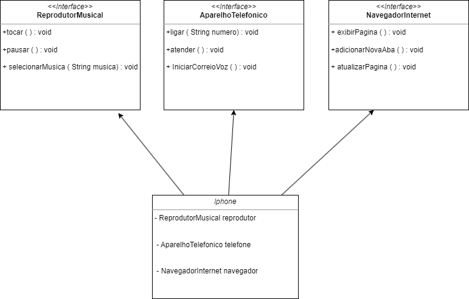

## Desafio Iphone DIO

## Modelagem e Diagramação UML do Componente iPhone
Este repositório contém a implementação de um desafio proposto pela Digital Innovation One (DIO). Este projeto utiliza princípios de programação orientada a objetos e técnicas de modelagem UML para criar uma estrutura que permite que um dispositivo iPhone desempenhe três papéis distintos e cruciais: Reprodutor Musical, Aparelho Telefônico e Navegador na Internet.

## Diagrama UML

Interfaces

- ReprodutorMusical
tocar() pausar() selecionarMusica(String musica)

- AparelhoTelefonico
ligar(String numero) atender() iniciarCorreioVoz()

- NavegadorInternet
exibirPagina(String url) +adicionarNovaAba() atualizarPagina() 

Classe 

- Iphone
A classe central, iPhone, implementa todas as interfaces mencionadas acima, consolidando as funcionalidades de reprodutor musical, telefone e navegador de internet em um único componente.

 Desenvolvido por Pedro Vale.